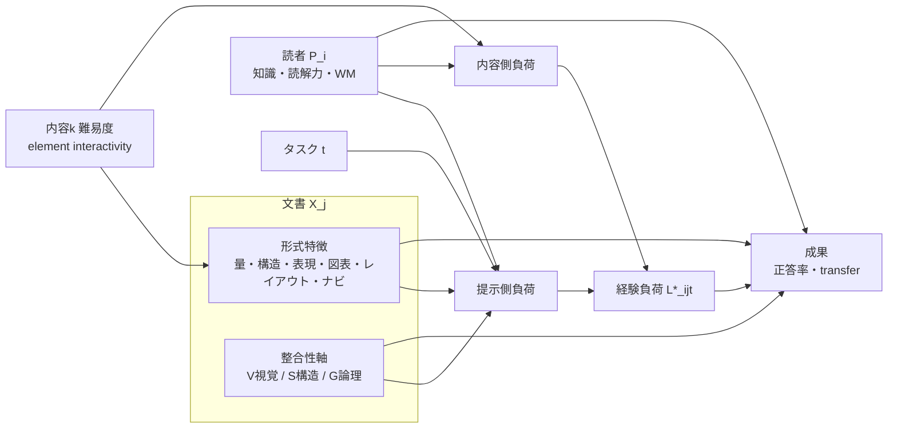
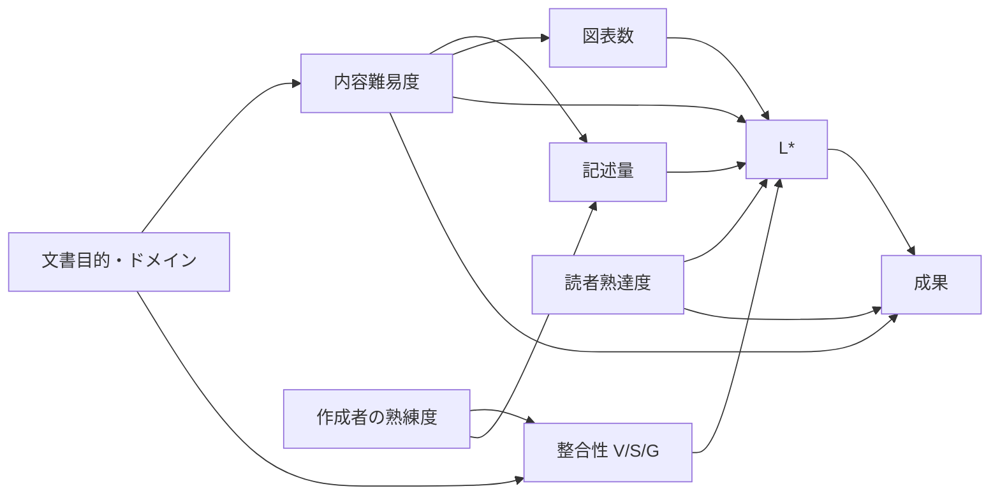
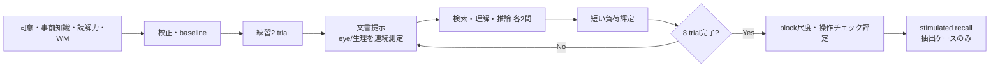

# 敵対的レビューと改訂版：「認知負荷の高いドキュメント」研究フレームワーク

**TL;DR**
- 元資料の方向性（文書特徴→経験負荷→成果を、同一内容の多version RCTと多モーダル測定で結ぶ）は妥当である。ただし致命的な欠陥が3点ある。①「文書誘発負荷」の定義が循環している、②performanceを負荷の潜在因子の指標に含めつつ結果変数とも呼んでいる、③2^4の8-run一部実施計画で交互作用を主仮説に置いている。この3点を直さない限り、因果主張は成り立たない。
- 「視覚的認知負荷」「構造的整合性」「論理的整合性」は、既存6特徴群（量・形式）を横断する「整合性・知覚品質」軸として加え、X_jを「形式特徴＋3整合性軸」に再定義するのがよい。どの軸についても「同一命題・同一レイアウトで整合性だけを崩すvariant」で因果効果を同定できる。
- 改訂版ではStudy 1（既存4因子、2^4完全要因）とStudy 2（新3軸、2^3完全要因）を分ける。どちらも参加者160名で、それぞれ2,560件と1,280件の曝露になり、算術的にも整合する。閾値τの外的基準による校正、SHAP／線形寄与による要因分解、DAG、事前登録、意味等価性検証を必須要素に組み込んだ。

---

# Part 1：敵対的レビュー報告

## 総評

元資料には三つの強みがある。可読性・認知負荷・workload・学習成果を概念上区別している点、同一内容の多version RCTを因果推論の中核に据えた点、grouped CVでdata leakageを防ぐ点である。いずれも維持すべきである。

最大の弱点は、この概念上の区別が後段の測定モデル・分析モデル・実験計画で守られていないことである。具体的には次の三つがある。
- 正答率を潜在負荷L*の指標に入れ、自ら否定した「負荷＝成果」の混同を測定モデルの中で再導入している。
- 負荷はstateだと主張しながら、文書に固定スコアDCLSを付与している。
- 交互作用を主仮説に置きながら、2因子交互作用が互いに交絡する8-run計画（2^(4−1)、resolution IV）を推奨している。

さらに、文書側の特徴が「量と形式」に偏っている。見出しと本文の食い違い、主張間の矛盾、視覚的階層の乱れといった、実務文書で頻出する「整合性」の欠陥を説明変数として扱えていない。

## 指摘一覧

### 致命的

| # | 箇所 | 問題と理由 | 修正方針 |
|---|---|---|---|
| F1 | サマリ「文書誘発認知負荷」の定義 | 「内容・読者・タスクを統制したときの負荷」と定義しながら、読者・タスクとの交互作用も主張している。統制後に残る量が交互作用の分だけ変わるので、定義が循環している。 | 同一内容kの基準versionとの対比として、参照母集団𝒫・参照タスクTに条件付けた因果対比 Δ_j(𝒫,T) で再定義する。交互作用は「Δ_jが𝒫やTで変わる効果修飾」と位置付ければ矛盾しない。 |
| F2 | 潜在変数モデル y_behavior = λ_5 L* + ε_5 | 負荷と成果は別物と述べながら、正答率を負荷の反映指標に含めている。L*→成果の媒介経路が識別できなくなり、構成概念がperformanceで汚染される。 | 正答率は測定モデルから外し、構造モデルの結果変数にする。読了時間・再読率はprocessing effort因子の指標として残す。 |
| F3 | 「8-runのfractional factorial」と交互作用仮説 | 2^(4−1)（I=ABCD）はresolution IVで、AB=CD、AC=BD、AD=BCが交絡するため、「構造×表現」などを推定できない。 | 2^4完全要因（16条件を2セッションに分割）に変更し、新3軸は別研究（2^3完全要因）で扱う。一部実施を使うなら、諦める交互作用を事前登録する。 |

### 重大

| # | 箇所 | 問題と理由 | 修正方針 |
|---|---|---|---|
| M1 | CLT三分法 | Kalyuga（2011）はgermaneがintrinsicと本質的に区別できず冗長でありうると論じた。Sweller（2010）はelement interactivityで再定式化し、Sweller, van Merriënboer & Paas（2019）はgermaneを「intrinsicに振り向けられる資源」として扱う。元資料はこれらに触れず、事前登録に委ねるだけである。 | 主モデルは提示側（extraneous）と内容側（intrinsic）の二成分とし、germaneは投資されたeffortとして補助的に測る。 |
| M2 | 単一潜在因子L* | 秒単位のpupilとtrial単位の主観を一因子にまとめている。構成概念（arousal、処理量、effortの評価）も時間尺度も異なる。 | trial水準でeffort・視覚処理・arousalの3因子とし、participant水準のtraitを分離する多水準SEMにする。 |
| M3 | 固定DCLSと「state」の主張 | 状態量を文書に固定値として付与する根拠がない。 | DCLS_j(𝒫,T)を参照母集団とタスクに条件付けた期待値として定義し、𝒫とTを必ず併記する。 |
| M4 | t検定ベースのサンプルサイズ | 参加者とstimulusの2つのrandom factorを無視している。Westfall, Kenny & Judd（2014）は、刺激変動がある設計では参加者を増やしても検出力が1に近づかないことを示した。 | 交差ランダム効果のsimulation power analysisを主手続きとし、contents数を主パラメータにする。 |
| M5 | 「24×8×10人＝1,920、160名×12 trial」 | 算術的には一致する（24×8＝192、192×10＝1,920、160×12＝1,920）。しかし12 trialでは8条件を均等に割り付けられない（12/8＝1.5）。content割付とcarryoverの統制も規定されていない。 | 「1参加者1 content1 version」「条件数の整数倍のtrial」「Latin square型リスト」を満たす設計に置き換える。 |
| M6 | 意味等価性・操作チェックがない | versionが同一命題を保持しているか、操作が意図した特徴差を生んだかを確認する手続きがない。 | 命題リストによる監査（専門家2名、κ）、自動特徴による操作チェック、参加者評定を実施する。 |
| M7 | pupil | 図表・レイアウトの操作では輝度・空間周波数がpupilと交絡する。Mathôt（2018）はpupilが知覚された明るさにも依存することを整理している。 | pupilはレイアウトを同一に保つ操作で主要指標、視覚操作では副次指標とし、局所輝度を共変量にする。 |
| M8 | 閾値τ | P(L_d > τ)のτの校正手続きがない。 | 外的基準（業務上許容できない誤答率）に対し、hold-outデータ上のROCとdecision curveで決め、事前登録する。 |
| M9 | 要因分解（+14等） | 算出法が不明で、独自の例示が既存手法の出力のように読める。 | 線形寄与の事後区間、または群単位のSHAPで算出し、例示であることを明記する。 |
| M10 | 媒介分析 | sequential ignorabilityの仮定が明示されていない。 | Imai, Keele & Tingley（2010）に従い、感度パラメータρを報告する。 |
| M11 | DAGがない | 言葉で触れているだけである。 | mermaidでDAGを明示する。 |
| M12 | 整合性特徴の欠落 | 見出し–本文、論理、視覚階層の整合性が説明変数にない。 | 新3軸として横断的に組み込む。 |

### 軽微

- **m1 添字**：L_{ijdt}/L_{ij}、X_d/X_jが混在し、jがtopicとdocumentを兼ねている → i＝participant、j＝version、k＝content、t＝task、s＝segmentに統一する。
- **m2 共線性**：記述量と情報密度、構造とナビ、レイアウトと図表が重複している → 群単位の階層shrinkageを使い、群単位の寄与を報告する。
- **m3 日本語解析**：辞書差・係り受け精度・専門語辞書への依存が過小評価されている → 2解析器のICCを報告し、文字ベース指標を並行して保存する。
- **m4 surprisal**：モデル依存性がある → 2モデル以上で算出し、順位相関を報告し、モデル版を凍結する。
- **m5 合成概念**：Integration Costの関数形とnavigation entropyのp_kが未定義 → 構成要素を別々に投入し、p_kは顕著性か実測クリックで推定する。
- **m6 主観尺度**：単一項目の信頼性と測定不変性の検証がない → block尺度で基準妥当性を確認し、多群CFAを行う。
- **m7 dual-task**：限定する判断は妥当だが、読解の変質を定量化していない → single/dual比較を報告する。
- **m8 混合研究**：codebook開発と統合規則が曖昧 → 二段階開発と「一致／拡張／不一致」判定を明示する。
- **m9 ギャップとロードマップ**：対応が示されていない → 対応表を付ける。
- **m10 mermaid**：D→B経路と、performanceを負荷指標とする本文が矛盾している → 構造モデルと測定モデルを分けて描く。
- **m11 オープンサイエンス**：事前登録・公開・生体データの扱いへの言及がない → 追記する。
- **m12 独自提案の区別**：DCLS等が既存標準のように読める → 【本報告の提案】と明記する。

## 新3評価軸の位置付けと設計方針（要約）

- **位置付け**：3軸は「何がどれだけあるか」（6特徴群）ではなく、「提示が読み手の予測・統合をどれだけ妨げるか」という品質の次元である。そのため6特徴群を横断する軸として配置する。
  - 視覚的認知負荷：知覚・探索段階
  - 構造的整合性：macrostructureの予測段階
  - 論理的整合性：situation model構築段階
- **CLT上の扱い**：同一命題を保持したまま変えられる範囲ではextraneous側の要因である。ただし「省略された前提」は、高知識読者には生産的な推論を生みうる。McNamaraら（1996）の逆cohesion効果がその根拠なので、熟達度による効果修飾を主仮説とする。
- **同定**：各軸について、当該軸だけを崩したvariantを作り、2^3完全要因で交互作用まで推定する（Study 2）。
- **信頼性**：自動指標は人手codebookを基準にICC・κ・較正曲線で検証する。LLM判定は順序入替と複数モデルによる評価を必須とする。

---

# Part 2：改訂版全文

# 認知負荷の高いドキュメントと、記述量・構造・表現・図表・整合性の関係を定量・定性評価する研究の包括的調査（改訂版）

## エグゼクティブサマリ

「認知負荷が高いドキュメント」は、文書だけに属する固定属性ではない。**参照母集団と参照タスクを明示したうえで、同一内容の基準versionに対してどれだけ負荷を増減させるか、という条件付きの因果対比**として定義すべきである。これが本改訂の中心的な結論である。

CLTは、作業記憶の制約のもとで、課題のelement interactivity、提示の仕方、学習者の知識が処理要求を決めるとする（Sweller 2010; Sweller, van Merriënboer & Paas 2019）。同じ文書でも、専門家と初心者、検索と精読では負荷が変わる。

**用語の定義（本報告の提案）**
- **文書誘発認知負荷**：Δ_j(𝒫,T) = E[L*∣do(version j), 𝒫, T] − E[L*∣do(version j₀(k)), 𝒫, T]。j₀(k)は内容kの基準versionである。読者・タスクとの交互作用は、Δ_jが𝒫やTによって変わる効果修飾として扱うので、定義と矛盾しない。
- **経験された認知負荷**：参加者i、version j、タスクtでの潜在状態L*_{ijt}。主観、眼球、生理、処理過程の行動から推定する。
- **成果**（正答率、transfer）：負荷の指標には含めず、結果変数とする。

**CLT下位概念の扱い**
- Kalyuga（2011）は、germaneが伝統的な扱いではintrinsicと区別できないと論じた。Krieglstein, Beege, Rey, Ginns, Krell & Schneider（2022, Educational Psychology Review 34:2485–2541）による主要4質問紙のメタ分析は三因子モデルをおおむね支持したが、負荷タイプ間の相関は「理論に基づく想定と部分的に矛盾する」と報告した。
- そこで本研究では「内容側（intrinsic）」と「提示側（extraneous）」の二成分を主モデルとし、germaneは投資されたeffortとして補助的に測る。

**測定**
Ayres, Lee, Paas & van Merriënboer（2021）は2016〜2020年の33実験をレビューし、主観尺度の妥当性が最も高く、生理指標の感度は課題に依存したと報告した。ただし対象は課題複雑性を被験者内で操作したintrinsic負荷の研究に限られ、設計由来（extraneous）負荷への一般化は検証が必要である。そこで次の多層構成をとる。
- trialごとの短い主観尺度
- 読了時間・再読などの過程指標
- eye-tracking
- 必要に応じてHRV・EDA
- 検証用サブサンプルでのEEG/fNIRS

統合には単一因子ではなく、effort・視覚処理・arousalの3因子とstate–trait分離を持つ多水準潜在変数モデルを使う。

**文書側の説明変数**
既存6特徴群（記述量・構造・表現・図表・レイアウト・ナビゲーション）に加えて、それらを横断する3軸を導入する（本報告の提案）。
- **V：視覚的認知負荷**（clutter、視覚階層の不明瞭さ、組版の乱れ）
- **S：構造的整合性**（見出し–本文の一致、階層・番号・表記・参照の一貫性）
- **G：論理的整合性**（矛盾、前提の飛躍、定義の変化、手順順序、数値不整合）

**研究デザイン**
因果同定の中心は、同一命題集合を保持した多version RCTである。
- Study 1：既存4因子を2^4完全要因で操作する。
- Study 2：新3軸を2^3完全要因で操作する。

**最大の研究ギャップ**は、日本語実務文書について、形式特徴・整合性特徴と多モーダル負荷測定を同一実験内で因果的に結んだbenchmarkがないことである。ZuCo（英語話者12名、EEG＋eye）やMECO（Siegelmanら2022：13言語の読者が同一の12本の百科事典的テキストを読んだL1のeye-trackingデータ。2025年のWave 2で13言語・16ラボ・654名を追加）は有用だが、文書設計を操作したデータではない。

図のF→Y、Z→Yは負荷を経由しない直接効果である（例：情報が欠落していれば、負荷に関係なく正答できない）。測定モデルは測定法の章で別に示す。

## 研究領域の整理と主要文献

**CLTの起点と更新**
- Sweller（1988）は、問題解決が作業記憶資源を消費し学習を阻害しうることを示した。Paas, Renkl & Sweller（2003）は、これを教材設計の研究体系として整理した。
- Sweller（2010）はelement interactivityでintrinsic/extraneousを再定式化した。Kalyuga（2011）は、germaneが実証ではなく理論的考慮から追加された概念であり、二分法で十分だと論じた。
- 本研究にとっての含意：文書設計の操作は「element interactivityを変えずに、提示由来の処理要求を変える操作」として定義する。内容を削る操作はintrinsic側を変えるので区別する。

**統合・冗長・信号**
- Chandler & Sweller（1991）はsplit-attention、Kalyuga, Chandler & Sweller（2004）は冗長な画面テキストの負の効果を示した。
- Lorch（1989）は、見出し・予告文・要約などのsignalが、手がかりを与えられた情報の記憶を向上させることをレビューした。Hyönä & Lorch（2004）は、見出しがtopic sentenceの処理と要約を変えることをeye-trackingで示した。Schneiderら（2018）のメタ分析（103研究、N＝12,201）は、signalingが保持・転移を改善し、認知負荷を低下させると報告している。
- 本報告の仮説（未検証）：信号が内容と食い違う場合、この効果は反転しうる。これが構造的整合性軸の根拠である。

**テキスト理解と整合性**
- Kintschのconstruction-integrationモデルでは、読み手は局所的な命題の結合と、全体のmacrostructureを構築する。
- Albrecht & O'Brien（1993）は矛盾パラダイムで、局所的には整合しているが先行情報と矛盾する文の読み時間が延びること（inconsistency effect）を示した。論理の破綻はオンラインの処理コストとして観測できる。
- McNamaraら（1996）は、低知識読者は高coherence文書から、高知識読者は低coherence文書から多く学ぶことを示した。熟達度による効果修飾を想定すべき根拠である。

**知覚負荷とclutter**
- Lavieら（2004）は、高い知覚負荷はdistractor干渉を減らし、作業記憶負荷はそれを増やすことを示した。
- Rosenholtz, Li & Nakano（2007）はfeature congestionとsubband entropyを提案し、視覚探索成績との相関を示した。Reineckeら（2013）は450サイトについて548名の評定からvisual complexityとcolorfulnessのモデルを構築した。

**ナビゲーション**
DeStefano & LeFevre（2007）は、hypertextのnavigationが追加の認知要求を生むことを整理した。

**談話・論証・矛盾の計算言語学**
- PDTB 2.0（Prasadら2008）は、明示的・暗黙的な談話接続を注釈した。Stab & Gurevych（2017）は、402本のエッセイでclaim/premise構造を注釈・自動解析した。de Marneffe, Rafferty & Manning（2008）は、矛盾の定義と類型を示した。
- 日本語資源は次のとおりである。
  - JGLUEのJNLI（25,015対。Fleiss κ＝0.399。仮説文のみのモデルが0.658の精度に達し、注釈artifactが示唆される）
  - JSICK（SICKの人手翻訳、9,927対）
  - KWDLCの談話関係注釈（Kawaharaら2014は10,000文書、2層7分類）

| 文献 | 種別 | 示唆 |
|---|---|---|
| Sweller 1988/2010; Sweller et al. 2019; Kalyuga 2011 | 理論 | element interactivity、germaneの再定義、二成分モデル |
| Chandler & Sweller 1991; Kalyuga et al. 2004 | 原著 | split-attention、redundancy |
| Lorch 1989; Hyönä & Lorch 2004; Schneider et al. 2018 | レビュー／原著／メタ分析 | signaling、誤信号仮説の根拠 |
| Albrecht & O'Brien 1993; McNamara et al. 1996 | 原著 | 矛盾のコスト、coherence×知識 |
| Lavie et al. 2004; Rosenholtz et al. 2007; Reinecke et al. 2013 | 原著 | 知覚負荷、clutter・complexity指標 |
| Leppink et al. 2013; Klepsch et al. 2017; Krieglstein et al. 2022 | 尺度 | CL下位尺度とその妥当性 |
| Ayres et al. 2021; Antonenko et al. 2010; Mathôt 2018 | レビュー | 生理指標、EEG、pupilの交絡 |
| Sato et al. 2008; Graesser et al. 2004; Crossley et al. 2016 | NLP | 日本語可読性、cohesion |
| Prasad et al. 2008; Stab & Gurevych 2017; de Marneffe et al. 2008 | NLP | 談話、論証、矛盾 |
| Westfall et al. 2014; Imai et al. 2010 | 方法論 | 交差ランダム効果の検出力、因果媒介 |

**概念の区別（下流で一貫して守る規則）**
- 可読性・3整合性軸 → 説明変数X_j
- 認知負荷 → 内部状態L*
- NASA-TLX → 補助的な広義のworkload
- 成果 → 結果変数Y

## 認知負荷の測定法と妥当性

| 方法 | 代表指標 | 構成概念・時間尺度 | 位置付け |
|---|---|---|---|
| 主観 | Paas型effort、Leppink 10項目、Klepsch尺度、NASA-TLX | effortの評価、trial〜block | 必須 |
| 過程行動 | 読了時間、再読率、検索時間 | 処理量、trial | 必須（負荷指標） |
| 成果行動 | 正答率、transfer | 結果変数 | 必須（負荷指標外） |
| Dual-task | 二次課題RT | 残余容量 | 基準妥当性の検証 |
| Eye | fixation、regression、AOI遷移、fixation分散、saccade振幅 | 局所処理・探索、秒 | 強く推奨 |
| Pupil | 刺激前ベースライン補正後の散大 | effortとarousal、秒 | 条件付き推奨 |
| HRV/EDA | RMSSD、phasic SCR | arousal | 補助 |
| EEG/fNIRS | 周波数帯パワー、HbO | 瞬時負荷 | 機序の検証 |

**主観尺度**
- 毎trial直後に1〜3項目（全体effort、提示由来の困難、内容由来の困難）を、block後に多項目尺度（Leppinkら2013またはKlepschら2017）を実施する。
- Krieglsteinら（2022）は、主要4質問紙の内的一貫性がいずれも満足できる水準であり、信頼性は教育場面・領域・提示形式・尺度点数によって差がなかったと報告したが、下位尺度の弁別性は本データで再検証する。
- 単一項目はblock尺度との相関で妥当性を確認する。熟達度群間では多群CFAで測定不変性を検証する。
- retrospective biasを抑えるため、評定はtrial直後に行う。

**Dual-task**：Brünken, Plass & Leutner（2003）の方式を、同一文書を使うサブ実験に限定する。single/dual比較で読解の変質を報告する。

**Pupil**：Mathôt（2018）によれば、pupilは知覚された明るさにも反応するため、等輝度でも交絡が残りうる。表示を同一に保てる操作（論理・表現・構造的整合性の一部）では主要指標とする。視覚・図表の操作では副次指標とし、注視点周辺の局所輝度を共変量にして、ベースラインで補正する。

**測定モデル（本報告の提案）**

y^{(m)}_{ijt} = ν_m + λ_m^E E_{ijt} + λ_m^V V_{ijt} + λ_m^A A_{ijt} + ε^{(m)}_{ijt}

- E（effort）：主観、読了時間、再読率
- V（視覚処理・探索）：fixation分散、探索時間、saccade
- A（arousal）：EDA、HRV、pupil（pupilはEとAへの交差負荷を許す）

participant水準のtrait成分 E_i^B、A_i^Bは、多水準SEMで群内と群間の分散を分けて分離する。経験負荷L*はEとし、VとAは機序因子として報告する。

**妥当性検証の手続き**

| 検証 | 手続き |
|---|---|
| 内容 | 専門家3名のレビュー、CVI≥.80 |
| 構成概念 | 多水準CFAで3因子と1因子を比較（ΔCFI、BIC） |
| 操作感度 | Study 1・2の操作でEが事前登録した方向に変わるか |
| 収束・弁別 | E↔読了時間の正の相関、E↔stress・興味・疲労の区別 |
| 基準関連 | Eが操作効果を超えて成果を予測するか |
| 信頼性 | ω、手動codingのKrippendorff's α（暫定≥.67、目標≥.80） |
| 不変性・一般化 | 熟達度・年齢・デバイスの多群CFA、G理論による分散分解 |
| ML | grouped/nested CV、外部test |

負荷はstateなので、長期のtest-retest相関は要求しない。代わりに条件効果の再現性と分散成分の安定性を評価する。

## ドキュメント要素の定義と指標化

### 全体構成（本報告の提案）

X_j = [F_j ; Z_j]

- F_j（形式特徴）＝[x_amount, x_structure, x_language, x_figure, x_layout, x_navigation]
- Z_j（整合性軸）＝[z_V, z_S, z_G]

重複を避けるため、次の規則を置く。
- x_layoutは設計パラメータ（行長・文字サイズ・行間・段組・余白）に限る。画像から算出する知覚的結果指標（clutter等）はz_Vに移す。
- x_structureは見出し数・階層深度などの量に限り、その正しさ・一貫性はz_Sに置く。
- 接続語の密度はx_languageに、接続語の適切性と論理関係の正否はz_Gに置く。
- 情報密度はx_amountの下位指標とし、群単位の階層事前分布で共線性に対処する。

日本語の信頼性確保のため、次の対策をとる。
- 形態素指標は2種の解析器（例：GiNZA/SudachiとMeCab/UniDic）で算出し、ICCを報告する。
- 係り受けは100文の人手正解で精度を確認する。
- 専門語辞書は版を凍結し、未登録語の比率を併記する。
- 文字ベース指標（文字数、漢字率、Satoら2008の文字unigram可読性）を並行して保存する。

### 形式特徴（F）

- **記述量**：文字数、形態素数、文数、段落数、節数、viewport当たりの文字量。情報密度（内容語数÷全形態素数、専門概念数／1,000形態素）。命題数（idea units）は人手の命題リストで数え、意味等価性の監査にも使う。
- **構造（量的）**：見出し密度、階層深度、節長の平均・CV、箇条書き率、TOCの有無、相互参照の数。
- **表現**：語彙頻度、専門語密度、依存構造の深さ、平均依存距離、文長とその分散、cohesionの量、名詞化、長い連体修飾、surprisal。surprisalは2モデル以上で算出し、Spearman相関が.8未満なら除外する（本報告の基準）。
- **図表**：タイプ（写真、概念図、フロー、グラフ、表、装飾）、図表密度、本文参照との距離、参照が明示されているか、ラベル数、系列数、表の行×列。Integration Cost（本報告の探索的概念）は構成要素を別々に投入する。タイプの手動codingはα≥.80を目標とする。
- **レイアウト**：行長（字数）、文字サイズ、行間、段組数、余白率。
- **ナビゲーション**：リンク数、click depth、スクロール距離、breadcrumbs、H_nav = −Σ_l p_l log p_l。p_lは顕著性またはpilotの実測クリックで推定する。

### 新評価軸1：視覚的認知負荷（z_V）

**定義（本報告）**：視覚的提示が、目的情報の検出・探索・階層の把握に課す知覚・注意上の処理要求。Lavieら（2004）に従い、z_Vは主にV因子（視覚処理）を媒介すると仮定する。CLT上は提示要因（extraneous）に置く。ただし高い知覚負荷は無関係な刺激の処理を減らしうるので、効果の方向は探索課題と精読課題で異なりうる（タスクによる効果修飾の仮説）。

| 下位次元 | 指標 | 根拠 |
|---|---|---|
| clutter | feature congestion、subband entropy、edge density（同一解像度・同一viewport） | Rosenholtzら2007 |
| complexity・色 | colorfulness、有効色数、図形要素数 | Reineckeら2013 |
| 空白・整列 | whitespace率、左端x座標のクラスタ数、要素間隔の分散 | 本報告の操作化 |
| 視覚階層 | 論理的な見出しレベルと視覚的顕著性（サイズ×ウェイト×コントラスト）の順位一致（Kendall τ）、同レベル書式の一致率 | 本報告の提案 |
| 知覚的な読みやすさ | 文字サイズ、行長、行間、コントラスト比（WCAG算式） | 組版研究・アクセシビリティ標準 |
| 日本語組版 | 漢字率、全角半角の混在率、縦横混在、禁則違反数、約物の連続（W3C JLReq／JIS X 4051の規則に対する違反数） | JLReq |
| 動的要素 | アニメーション・自動再生の面積比 | — |

DocLayNet（80,863ページ、11クラス）で学習した検出器でブロックを抽出し、ブロック単位でz_Vを算出して位置別負荷に対応付ける。

測定は、探索時間、fixationの空間的分散、saccade振幅、visual clarity評定で行う。妥当性は二段階で確かめる。まずpilotで100ページについて人の煩雑さ評定（10名、ICC(2,k)）と相関をとる。次にStudy 2で、操作効果がV因子を経由するかを検証する。

### 新評価軸2：構造的整合性（z_S）

**定義（本報告）**：構造的信号（見出し、番号、目次、書式、相互参照、テンプレート）が内容構成と一致し、内部で一貫している程度。量的構造とは別の次元である。

理論的位置付け：Lorch（1989）やSchneiderら（2018）のsignaling効果は、信号が内容を正しく予告することを前提にしている。不一致はmacrostructureの予測を誤らせ、schemaの形成を阻害し、予測違反による再読を生むと仮定する（誤信号仮説、未検証）。Kintschのconstruction-integrationやMeyerのtop-level structure研究では、読み手が構造を手がかりにmacrostructureを作る。構造的整合性は、その手がかりの信頼性に当たる。

| 下位次元 | 指標 |
|---|---|
| 見出し–本文 | 見出しと節本文の埋め込み類似度を他節との類似度で標準化したもの（z化alignment）、NLIによる主題の一致判定率 |
| 階層 | レベル飛び数（H2→H4等）、同階層の粒度バランス（節長CV） |
| 並列性 | 同階層の見出し・箇条書きの文法形式の一致率 |
| 表記 | 表記ゆれ率（同一概念の異表記数÷概念数）、番号様式の一致率 |
| 参照 | 相互参照の誤り率、図表番号と本文参照の一致率、キャプションと図の一致 |
| TOC・IA | TOCと本文の見出し一致率、同種文書間のテンプレート一致（節順序の編集距離） |

検証は、専門家評定（3名、α）との相関、見出し直後の第1回目の読み時間と見出しへのregression、retrieval課題の探索時間・成功率で行う。

### 新評価軸3：論理的整合性（z_G）

**定義（本報告）**：主張・定義・手順・数値が互いに矛盾せず、推論に必要な前提と関係が明示されている程度。

理論的な関係は二つある。Albrecht & O'Brien（1993）のinconsistency effectのとおり、矛盾はオンラインで検出され処理コストを生む。また、明示されない関係は橋渡し推論（bridging inference）を要求し、situation modelの構築を難しくする。

内容難易度との区別：同一の命題集合と推論ステップ数を保ったまま、記述の順序・明示性・一貫性だけを変える部分を提示側（extraneous）とみなす。命題そのものを欠落させる操作は内容を変えることになるので、操作は命題リストを保持する形に限る。McNamaraら（1996）を踏まえ、熟達度との交互作用を主仮説とする。

| 下位次元 | 指標 | 自動化と限界 |
|---|---|---|
| 矛盾 | 同一エンティティ・事象を扱う文ペアの矛盾率 | JNLI/JSICKで学習した日本語NLI。JNLIには注釈artifactの兆候があり、JSICKの評価では語順・格標示への鈍感さが示されたため、人手注釈で再現率を較正する。定義はde Marneffeら（2008）に従う |
| 談話関係の明示 | 明示的な接続表現の数÷関係の総数、接続表現の適切性 | KWDLC型7分類の分類器。クラウド注釈は質が劣るとの報告があるため、専門家による検証サブセットを置く |
| 論証の完全性 | claim–premise–warrantの充足率（支持のないclaimの割合） | Stab & Gurevych（2017）を改変し、人手codebookを主とする |
| 定義の一貫性 | 用語ごとの文脈埋め込みの分散、定義文との不一致数 | 半自動 |
| 手順 | 依存グラフ上の順序違反数、閉路の有無 | 抽出は半自動、依存は人手で確認 |
| 数値・条件 | 同一量の数値の不一致数、単位の不整合、例外・条件の明示率 | ルール＋人手 |

**LLMによる評価**：Zhengら（2023）は、GPT-4の判定が人間の選好と80%超一致し、人間同士と同水準であると報告した。一方でposition bias、verbosity bias、self-enhancement biasも示している（順序を入れ替えても判定が一貫したのはGPT-4で65.0%）。そこで次を必須とする。
- 提示順の入替による二重評価
- 2モデル以上の併用
- 全文書の20%を人手codebookの較正サブセットにする
- LLM出力を最終ラベルにしない

**測定**：推論問題の正答率（結果変数）、矛盾・欠落箇所でのregressionと第2回目の読み時間、「わかりにくい箇所」のクリック特定、stimulated recallでの「なぜ？」型発話。

### 3軸の統合

- **配置**：3軸は横断軸とする。各欠陥がどの群の対象物に生じたか（例：図表番号の不一致＝x_figureに関するz_S）をタグとして保存する。
- **軸間の仮説（本報告の提案）**：z_V（階層の不明瞭さ）→構造の把握困難→z_Sの信号が使えない→論理の追跡困難、という連鎖を仮定する。Study 2でV×S、S×Gの交互作用として検定する。
- **操作**：
  - V：テキストと論理構造を同一に保ち、階層書式の不統一とclutterを付加する。
  - S：見出しの誤り・レベル飛び・表記ゆれ・参照誤りを所定数挿入する。
  - G：命題を保持したまま、接続表現の削除・用語の揺れ・手順の入替・数値の不一致を所定数挿入する。
- **操作チェック**：①自動指標で意図した差が出ており、他軸の指標差は|d|<0.2であること、②専門家が盲検で判別できること、③参加者の知覚評定。
- **信頼性検証**：100文書の較正セットで、ICC、κ/α、較正曲線を報告する。合格基準（例：ICC≥.75）は事前登録する。

## 定量分析と高・低負荷の推定フレームワーク

**添字**：i＝participant、j＝document version、k＝content（k[j]）、t＝task、s＝segment。

**基本モデル**

L*_{ijt} = β_0 + β^T X_j + γ^T P_i + δ^T T_t + θ^T (X_j ⊗ P_i) + κ^T (X_j ⊗ T_t) + u_i + w_{k[j]} + v_j + ε_{ijt}

- u_iはparticipantのランダム切片とランダム傾き。最大構造から始め、事前登録した順に簡略化する。
- w_kはcontentの効果、v_jはversionの残差。
- 識別の目安（本報告）：σ_w²の推定にはcontent 20件以上が望ましい。σ_v²の推定には、同一versionを複数の参加者が読むことが必要である。操作因子はcontent内で変わるので、w_kと交絡しない。

**成果モデル**：Y_{ijt}をlogit混合モデルで、L*、X_j、P_iから説明する。

**回帰・非線形**：観察コーパスでは群単位の階層shrinkage（grouped horseshoe）とGAMを使う。記述量の二次項 β_1 x + β_2 x² は、同一内容で記述量を3水準以上操作した場合に限って識別可能である。観察データではU字形の主張に使わない。

**機械学習**：leave-participant-group-out、leave-content-out（同一内容の全versionを同じfoldに入れる）、leave-domain-outの三段階で評価し、nested CVを使う。評価指標は、二値ならAUROC、AUPRC、Brier、較正、連続ならMAE、R²、順位相関である。

**DAG**

観察コーパスでは、内容難易度と作成者の熟練度が主な交絡要因である。代理変数（element interactivityの専門家評定、作成組織）を調整してDMLを適用し、未測定交絡への感度（E-value）を報告する。因果主張の中心はRCTとする。

**媒介分析**：X（無作為化）→L*→Y の経路をImai, Keele & Tingley（2010）の枠組みで推定する。L*は無作為化されていないので、L*–Y間に未測定交絡がないという仮定は検証できない。感度パラメータρを示し、「相関的媒介」と「仮定付きの因果的媒介」を区別する。

**DCLS（本報告の提案。既存の標準尺度ではない）**
- DCLS_j(𝒫,T) = E_{i∈𝒫}[E(L*_{ijt} ∣ X_j, P_i, T)]。𝒫とTを必ず併記する（例：「初心者・検索課題」）。
- zDCLS = (DCLS − μ_ref)/σ_ref。参照分布は、Study 1・2の全versionにおける同じ𝒫、Tの分布とする。
- τは外的基準（検索誤答率が事前登録した許容値を超えること）に対して、hold-outデータ上のROC（Youden指数）とdecision curveで決める。報告するのは P(DCLS_j > τ ∣ data) である。分位による区切りは探索段階の記述にとどめる。
- Experienced Load Score（L*の推定値）と、Predicted Document Load Score g(F_j, Z_j)を区別し、両者の較正をcontent単位のCVで報告する。

**要因分解**：混合モデルでは C_{jg} = Σ_{m∈g} β_m (x_{jm} − x̄_m^ref) を事後区間とともに示す。MLでは群単位のSHAP（背景は参照分布）を使う。SHAPは予測への寄与であって介入効果ではないので、「直せば下がる」と言えるのはRCTで操作した因子だけである。

**出力の例示（架空例）**
> 初心者・検索課題：DCLS 72/100（95%信用区間64–79、P(DCLS>τ)=0.86）
> 主な寄与：論理的整合性（手順の順序違反）+11、専門語密度+9、図本文分離+8、見出し不一致+6
> 専門家・検索課題：51/100。高負荷候補：Section 3.2

## 実験デザイン・定性的評価・混合手法

**共通原則**
- 1参加者は1 contentを1 versionだけ読む（carryoverの排除）。
- 条件はLatin square型リストで割り付け、提示順は無作為化する。
- 各trialに検索・理解・推論を2問ずつ含め、task×特徴の交互作用をtrial内で推定する。
- 練習trialを2つ置き、trialの通し番号を共変量にし、8 trialごとに休憩を入れる。

**Study 1（2^4完全要因）**

| 因子 | 低負荷想定 | 高負荷想定 | 等価性の条件 |
|---|---|---|---|
| A 記述量 | 簡潔 | 冗長（反復・余談を追加） | 命題リストが一致 |
| B 構造 | 見出し・段落あり | flat | 内容順序が一致 |
| C 表現 | 平易 | 専門語・複雑構文 | 事実情報が一致 |
| D 図表統合 | 近接・直接ラベル | 遠隔・凡例分離 | 図の情報量が一致 |

32 contents×16条件＝512 versions。各参加者は16 contents（各条件1回）を2セッションで読む。32 contentsを16件ずつ2セットに分け、16条件のLatin squareと組み合わせて32リストを作る。N＝160で各リスト5名。曝露数は160×16＝2,560で、1 versionあたり5名（2,560÷512）。全ての2因子交互作用は主効果と交絡しない。

**Study 2（2^3完全要因：V・S・G）**
16 contents×8条件＝128 versions。各参加者は8 contentsを読み、16リスト×10名となる。曝露数は160×8＝1,280＝128×10。pupilはV=整合の条件内でのS・G比較で主要指標とする。

**検出力**：単純な対応ありt検定ではd_z=.30に約90名、.25に約128名、.20に約199名が必要になるが、これは刺激変動を無視した値である。pilotで分散成分を推定し、交差ランダム効果モデルのsimulation（1,000回）で主効果（d=.25）、特徴×熟達度（d=.20）、3軸間の交互作用の検出力を確かめる。不足する場合はcontentsを増やす。上記の数値は暫定値である。

**意味等価性**
1. 基準versionから命題リストを作る。
2. 盲検の専門家2名が、各versionについて命題の保持・欠落・追加を判定する（κ≥.80）。
3. 双方向NLIと埋め込み類似度で補助的に確認する。
4. 基準を満たさないversionは修正し、再判定する。

**操作チェック**：自動特徴で意図した差と他因子への漏れを確認し、参加者の事後評定も確認する。

**共変量**：事前知識テスト（contentごとに5問）、経験年数、日本語読解力、WM容量（operation span等）、年齢、教育歴、デバイス。熟達度は連続変数として扱う。

**定性研究**：pilot（24〜36名）ではthink-aloudでtaxonomyを作り、本試験ではgaze replayを使ったretrospective stimulated recallを行う。codebookはまず演繹的なcode（information search failure、terminology breakdown、figure–text integration、navigation disorientation、heading mismatch、contradiction detection、missing premise、visual confusion）を置き、次に帰納的なcodeを追加する。転記の20%を2名でcodingし、Krippendorff's αを報告する。

**混合研究法**：explanatory sequential design（QUAN→QUAL）。予測通りの高負荷、予測は低いが実測は高い、予測は高いが実測は低い、の3群から各8〜10名を抽出する。joint display上で「一致／拡張／不一致」を判定し、不一致を新しい特徴候補として登録する。

| 箇所 | 定量特徴 | gaze | 主観 | interview | 判定 |
|---|---|---|---|---|---|
| Sec. 2（G：手順の入替） | 依存違反2 | regression↑ | 高 | 「前の手順に戻った」 | 一致 |
| Sec. 3（S：見出し不一致） | alignment z=−1.8 | 見出しへのregression↑ | 中 | 「見出しと違う話だった」 | 一致 |
| Fig. 4（V：clutter高） | FC上位10% | 探索時間↑ | 低 | 「図は見なかった」 | 不一致（回避方略） |

**事前登録・公開・倫理**：仮説、主要アウトカム（E因子、正答率）、モデル、τの決定規則、除外基準、検出力simulationのコードを事前登録する。刺激・コード・集約データを公開する。gaze・生理・EEGは生体情報として扱い、同意範囲の区分、仮名化、顔映像の破棄、保存期間を定め、倫理審査を受ける。

## ツール・データセット・研究ギャップと研究ロードマップ

| 資源 | 利用 | 限界 |
|---|---|---|
| Sato et al. 日本語可読性 | 表現のbaseline | 負荷そのものではない |
| GiNZA等 | 言語特徴 | 解析器に依存 |
| Coh-Metrix / TAACO | cohesion指標設計の参照 | 英語中心 |
| DocLayNet / PubLayNet | ブロック検出、z_Vの位置対応 | 負荷ラベルなし |
| Rosenholtz clutter実装 | z_V | 文書画像での妥当性は要検証 |
| JNLI（25,015対）/ JSICK（9,927対） | z_Gの矛盾検出 | キャプション・翻訳由来でドメインが異なる |
| KWDLC 談話関係 | 談話関係の明示率 | クラウド注釈の質 |
| ZuCo / MECO | multimodal処理パイプラインの試作 | 文書設計の操作なし |
| NASA-TLX、Leppink/Klepsch | 主観指標 | 自己報告に依存 |

**データschemaの追加項目**
- Document：`content_id`、`version_id`、`manipulation_codes`、`proposition_list`、`integrity_features{V,S,G}`、`defect_annotations`
- Trial：`segment_level_gaze`、`task_item_type`

| # | ギャップ | 対応する段階 |
|---|---|---|
| 1 | 可読性と経験負荷の空白 | Study 1、予測モデル |
| 2 | 記述量の因果効果 | Study 1（因子A、3水準の追加実験） |
| 3 | 構造とナビゲーションの区別 | Web版の外部検証 |
| 4 | 図表統合のコスト | Study 1（因子D） |
| 5 | 日本語固有の要因 | 特徴の信頼性研究 |
| 6 | expertise reversal | Study 1・2の熟達度との交互作用 |
| 7 | multimodal構成概念の妥当性 | Eye/生理の検証研究 |
| 8 | 外部一般化 | 外部検証 |
| 9 | ground truthと閾値 | τ校正 |
| 10（新） | 整合性の因果効果と自動評価の信頼性 | 較正セット、Study 2 |

| 段階 | 目的 | 規模（暫定） |
|---|---|---|
| Pilot | taxonomy、分散成分、等価性の手順 | 24〜36名、contents 8 |
| 特徴の信頼性研究 | 解析器間ICC、自動指標と人手の一致 | 100文書 |
| Study 1 | 形式4因子の因果効果 | 160名、2,560曝露 |
| Study 2 | 新3軸の因果効果 | 160名、1,280曝露 |
| Eye/生理の検証 | 3因子測定モデル | サブサンプル60〜80名 |
| EEG/fNIRS | 機序の補強 | 40〜60名 |
| 予測・外部検証 | 文書だけからのDCLS推定と未知ドメインでの検証 | 多ドメインの実文書 |

**結論**：一次仮説は L*_{ijt} = f(F_j, Z_j, P_i, T_t)、Y_{ijt} = h(L*_{ijt}, F_j, Z_j, P_i) である。研究は二本立てで進める。同一内容のRCTは「何を直せば負荷が下がるか」に、実文書の外部予測は「新しい文書を判定できるか」に答える。DCLS、3軸の指標、閾値の規則はいずれも本報告の提案であり、Study 1・2と外部検証で妥当性を実証するまでは、診断ツールとして運用すべきではない。
