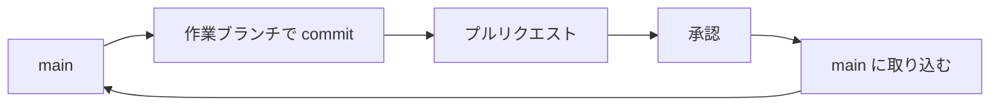

# 新人向け Gitブランチ運用ルール

## まず覚える流れ

変更は、main に直接 push しないでください。
作業ブランチ、プルリクエスト、承認の順に進めてから、main に取り込みます。

最初に、3つの言葉を短く説明します。
ブランチは、変更の履歴を枝分かれさせて持つ、自分用の作業場所です。
main は、チーム全員が共有する大もとのブランチです。
プルリクエストは、ブランチの変更を main に取り込んでほしいと頼む仕組みです。
頼まれた人が変更を確かめ、「取り込んでよい」と認めることを承認と呼びます。

図1は、変更を main に取り込むまでの流れを表したものです。



図1: 変更を main に取り込むまでの流れ

それぞれの詳しい説明は、「ブランチとプルリクエストの仕組み」の節にあります。

## main に直接 push しない理由

main への直接 push は、チーム全員の作業や本番に影響しかねません。
main は、チーム全員が作業を始める土台です。
本番に出す変更も、main から作ります。
そのため、main が壊れると、その影響は全員に届きます。

先月、main への直接 push による事故が2回ありました。
1回目は、ビルドが壊れました。
その結果、チーム全員の作業が半日止まりました。
2回目は、誰も確認していない変更が本番に出かけました。
リリースの直前に気づき、変更を取り消しました。
2件とも、原因は確認を通さずに main を変えたことだと考えられます。

今月は仕組みで止まらないので、直接 push は自分で避けるしかありません。
main に直接 push しても、今はまだ拒否されないのです。
来月、GitHub の設定で拒否するように変える予定です。
設定が変わったあとも、この流れを知っておく必要があると考えられます。
設定は push を拒否するだけで、正しい手順は教えてくれないからです。

## ブランチとプルリクエストの仕組み

ブランチとプルリクエストを使うと、変更はほかの人の確認を通ってから main に入ります。
では、この2つはどうやって main を守るのでしょうか。

### ブランチ

ブランチで commit しても、main の内容は変わりません。
ブランチは main から分かれた、自分用の作業場所だからです。
作業の途中で失敗しても、ほかの人には影響しません。

ブランチは、作業ごとに1つ作ります。
2つの作業を1つのブランチに混ぜると、困ることがあります。
片方だけ直しが必要になったとき、もう片方も取り込めなくなるのです。
作業ごとに分けておけば、確認も取り込みも作業ごとに進められます。

### プルリクエスト

プルリクエストを出すと、変更を main に取り込む前にレビューを受けられます。
レビューとは、ほかの人が変更を読み、問題がないかを確かめることです。

社内ルール（2026年9月時点）では、マージの前に1名以上の承認が必要です。
マージとは、ブランチの変更を main に取り込むことです。
作業ブランチからマージまでの流れを守るかぎり、main に入る変更はすべて、ほかの人の目を通ります。
先月の2件の事故の変更も、レビューがあれば見つかった見込みが高いと考えられます。

## 作業の手順

ここからは、5つの手順を順に説明します。
この手順で、最初から最後まで自分で進められます。
ただし、コンフリクトの直し方は扱いません。
コンフリクトとは、自分の変更とほかの人の変更が、同じ箇所でぶつかることです。
コンフリクトが起きたら、先輩に相談してください。

### 作業ブランチの作成

作業ブランチは、main を最新にしてから作ります。
始める前に、手元の変更はすべて commit しておきましょう。
そのうえで、次の3行を上から順に実行します。

```bash
git switch main
git pull
git switch -c feature/login-button
```

上の3行のうち、1行目で main に移り、2行目で main を最新にします。
3行目で新しいブランチを作り、そのブランチに移ります。

ブランチの名前は、社内ルールで次の2通りと決まっています。

- feature/<内容>: 新しい機能を作るとき
- fix/<内容>: 不具合を直すとき

例のブランチ名は、新しい機能を足す作業を想定しています。
<内容> の書き方に迷ったら、先輩に確かめてください。

### 変更の commit と push

作業ブランチで commit し、ブランチごと GitHub に送ります。
commit のしかたは、いつもと同じです。

```bash
git add .
git commit -m "ログインボタンを追加"
git push -u origin feature/login-button
```

git push -u origin の origin は、GitHub 上のリポジトリを指す名前です。
新しいブランチを作るたびに、最初の push にだけ -u を付けます。
2回目からは、git push だけで送れます。

### プルリクエストの作成

ブランチを送ったら、GitHub の画面でプルリクエストを作ります。

1. リポジトリのページを開き、「Compare & pull request」を押します。
2. 取り込み先が main になっていることを確かめます。
3. 題名と説明を書きます。何をなぜ変えたかを書いてください。
4. 右側の「Reviewers」で、レビューを頼む人を1名以上選びます。
5. 「Create pull request」を押します。

手順1のボタンが見つからないときや、誰にレビューを頼むか迷ったときは、先輩に相談してください。

### レビューへの対応

レビューの指摘は、プルリクエストの画面にコメントとして届きます。
たとえば、正しく動くか、目的に合っているか、読みやすいかを見てもらえます。

指摘を受けたら、同じブランチで直して push します。
新しい commit は、プルリクエストに自動で加わります。
プルリクエストを作り直す必要はありません。
直したら、コメントに返信して知らせましょう。

> 注意: 承認のあとに変更を足したら、もう一度レビューを頼んでください。足した変更は、まだ誰も確認していないからです。

### マージ

1名以上の承認を受けたら、プルリクエストを出した本人がマージします。
承認されると、プルリクエストの画面にそのことが表示されます。
社内ルールでは、マージの方法は squash merge と決まっています。
squash merge は、ブランチの commit を1つにまとめて main に取り込む方法です。
プルリクエストの画面で「Squash and merge」を押してください。

マージが終わったら、次の作業は「作業ブランチの作成」の手順から始めます。

## まとめ

迷ったら、次の流れを思い出してください。

- main には直接 push しない
- main を最新にしてから、feature/ か fix/ で始まるブランチを作る
- ブランチを push し、プルリクエストを出す
- 指摘は同じブランチで直して push する
- 1名以上の承認を受ける
- 自分で「Squash and merge」を押す
