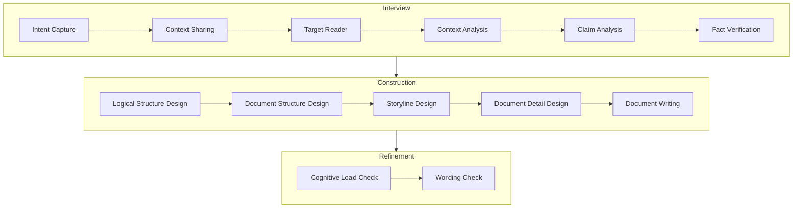

# ワークフロー

## ワークフローの概要

| フェーズ | 内容 |
| --- | --- |
| Interview | ユーザーが何をドキュメントにしたいか、誰に対してドキュメントを作成するか、ドキュメントの対象となる情報の収集をユーザーに対するヒアリングやエージェント自身による調査に寄って行う。ユーザーに対するヒアリングはこのワークフロー自体のUXにもつながる部分。 |
| Construction | ドキュメントの設計・構築を行う。論理的な構造の設計や、ドキュメントの見せ方・構成の設計、ストーリーライン、ドキュメントの詳細設計を行う。どのような見せ方をするかもこのフェーズで決定する。論理的な構造設計では、Lean 4を用いて論理的な正当性を検証する。曖昧性のあるものはaxiomで定義した上で、Interviewで得られたFactに基づいて帰納的に正しさの度合いを明らかにする。 |
| Refinement | ドキュメントを、認知負荷や言葉遣いに基づいてレビューを行い改善を行う。認知負荷のチェックは文章構成的なものだけでなく、短期記憶・中期記憶に基づくもの、視覚的なものも含む。言葉遣いは対象とする読者の知識集合を想定して、それを辞書的に扱って一般的でない表現を修正する。 |

## Interviewフェーズ

| ステージ | 内容 |
| --- | --- |
| Intent Capture | ユーザーの目的をキャプチャする。ユーザーが誰に対する何をドキュメントにしたいかを理解する。 |
| Context Sharing | ユーザーが伝えたい内容が生じた発端となったプロジェクトや、そのプロジェクトに関連するデータや情報をユーザーから聞く。 |
| Target Reader | 対象となる読者のペルソナを詳細に明らかにする。どういう層に届けたいか、どんな知識レベルを持つか定義する |
| Context Analysis | Context Sharingで得られた情報を分析し、ドキュメントで伝えるべき情報を分析・抽出する |
| Claim Analysis | ドキュメントで主張したい内容を、Context Analysisで抽出した情報を元に分析し、詳細化する。 |
| Fact Verification | ドキュメントに記載されている事実を、外部の信頼できるソースや実際にエージェント自身で実行・検証・分析を行って確認する。 |

## Constructionフェーズ

| ステージ | 内容 |
| --- | --- |
| Logical Structure Design | ユーザーがドキュメントで主張したいことを、論理的に構造化し、Leanで記述する。 |
| Document Structure Design | ドキュメントの大まかな構造・見せ方を設計する。 |
| Storyline Design | ドキュメントのストーリーラインを設計する。 |
| Document Detail Design | ドキュメントの詳細な内容を設計する。ある項目を文章で表現するか、図表で表現するか、またはその両方を組み合わせて表現するかを決定する。 |
| Document Writing | ドキュメントの内容を書き出す。 |

## Refinementフェーズ

| ステージ | 内容 |
| --- | --- |
| Cognitive Load Check | ドキュメントの認知負荷を文章構成だけでなく、読者の認知能力（短期記憶・中期記憶、視覚的認知能力等）に基づいて評価し、改善を行う。補足として視覚的認知能力での検査は、中心視野・有効視野の考え方も導入する（フォーカスしているところ以外を少しぼやかす。語を飛び飛びにフォーカスして全体の内容を理解できるかを評価したりする）。|
| Wording Check | ドキュメントの言葉遣いをチェックし、読者にとって理解しやすいように改善する。 |
